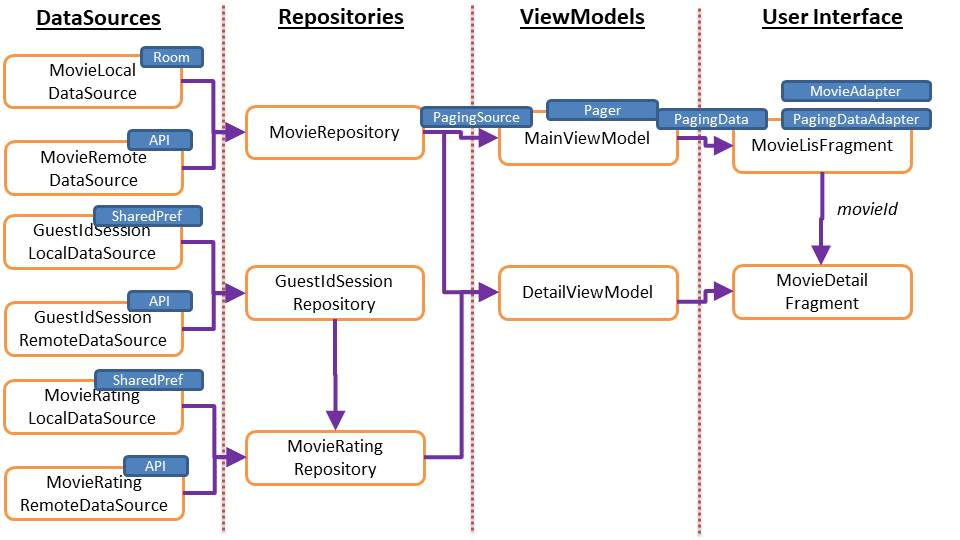
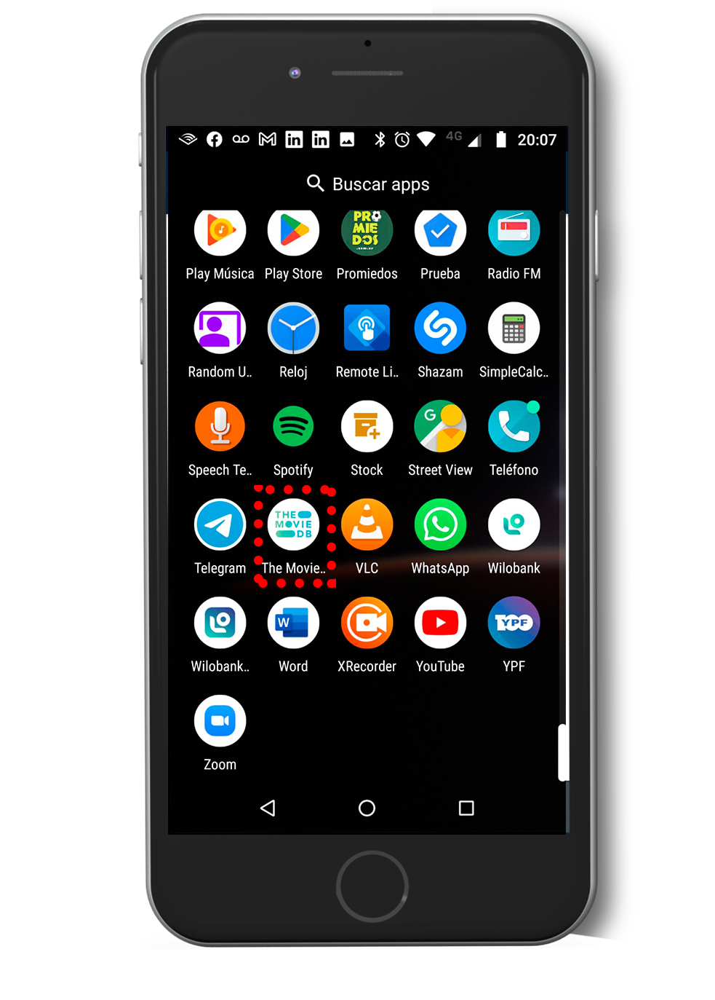
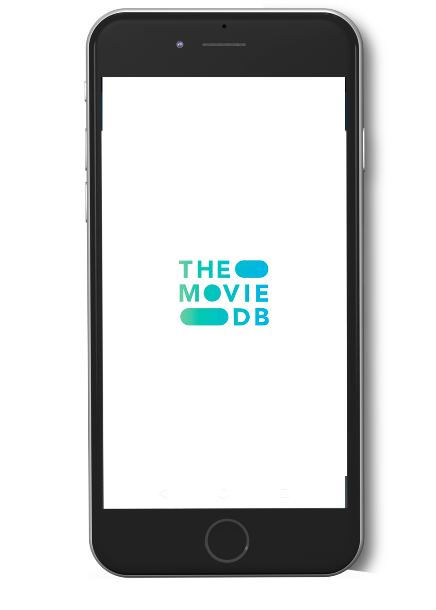
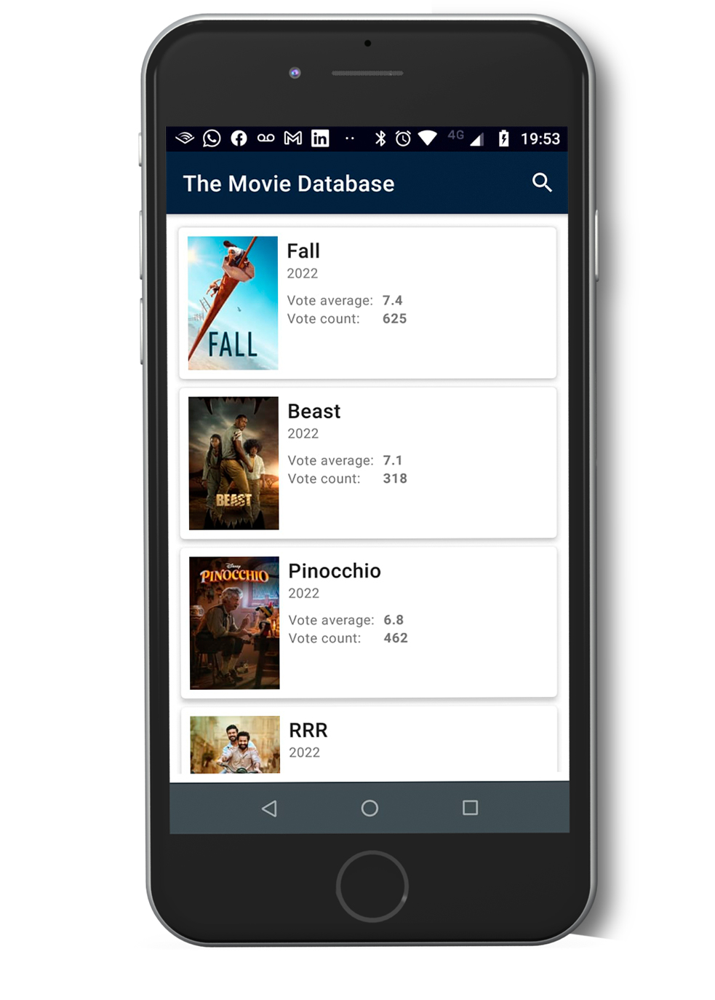
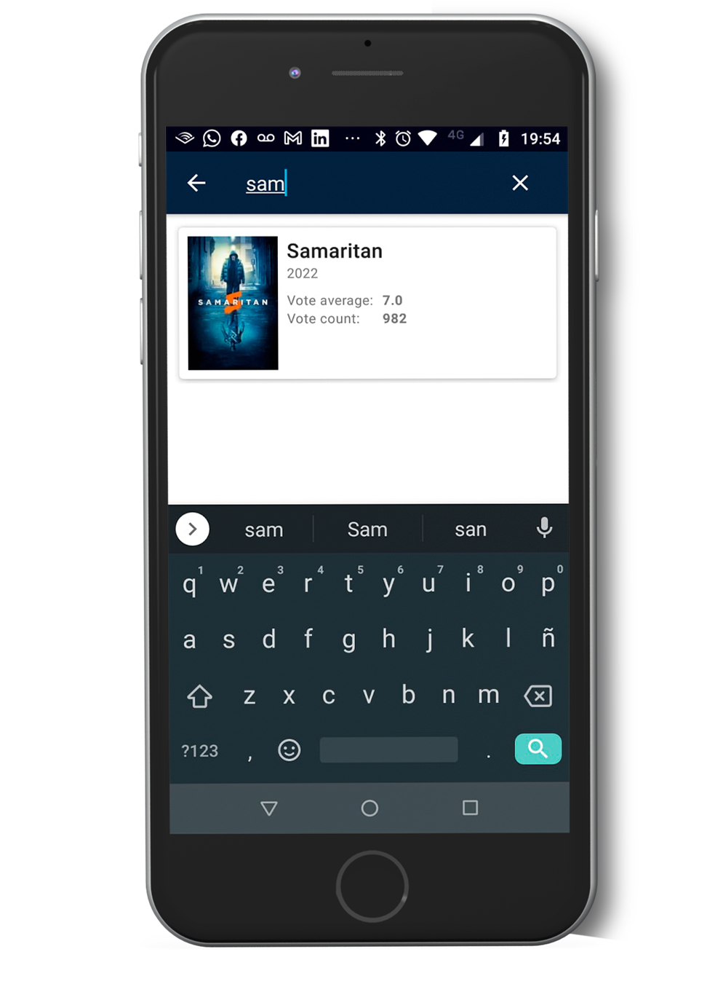
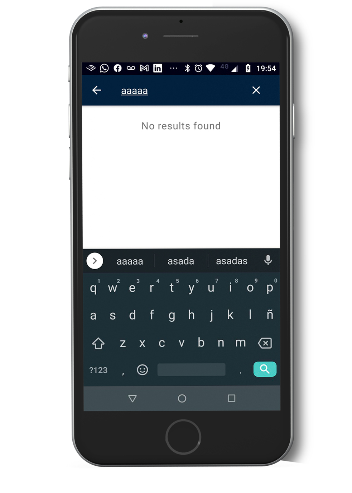
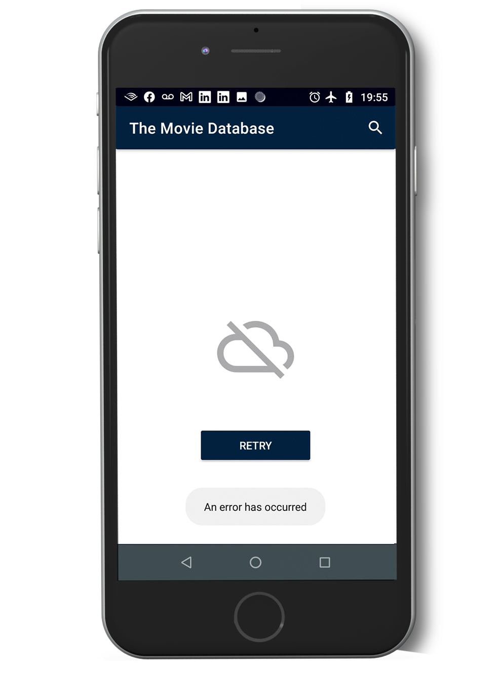
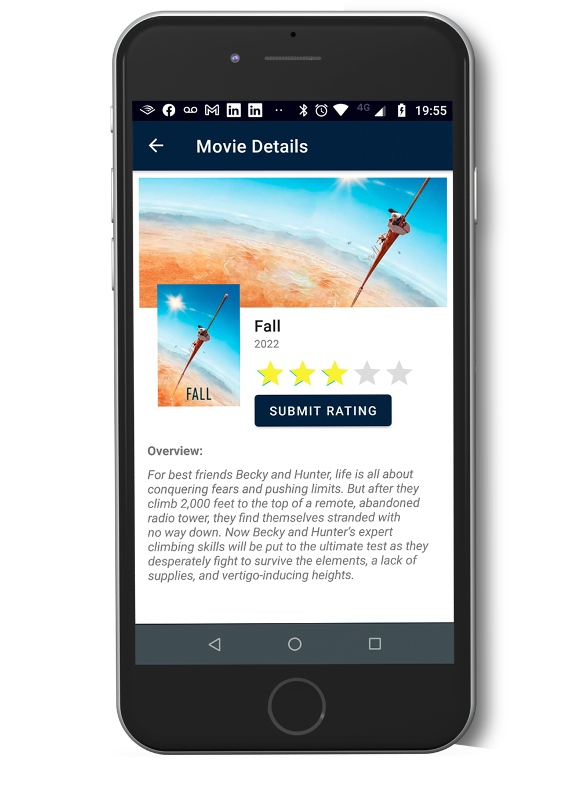
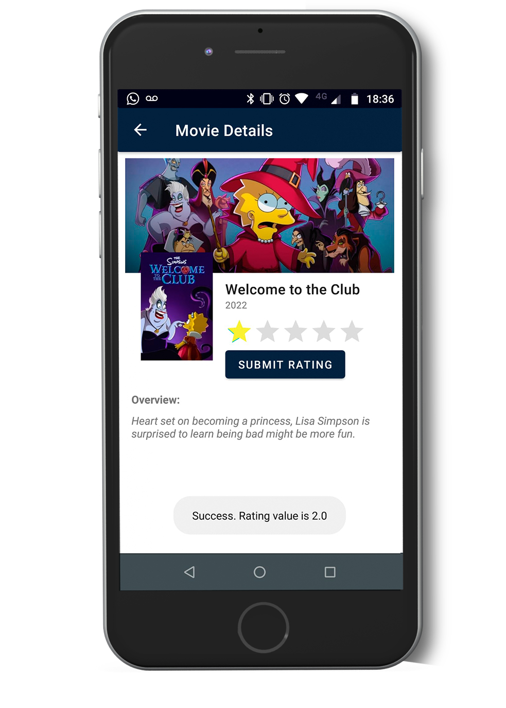
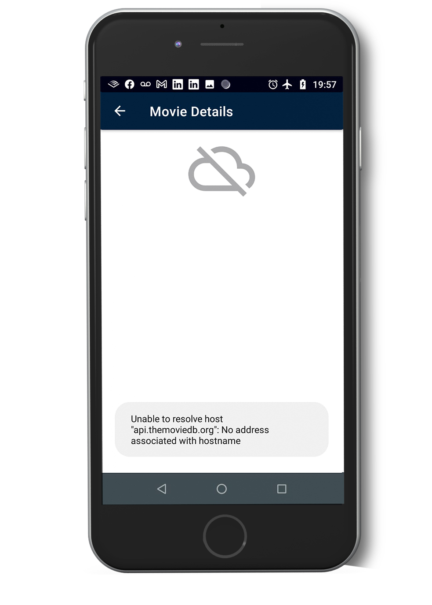

The Movie Data Base App
===================================

Overview
--------------
An app that consumes a REST API from http://api.themoviedb.org/3/ and displays the results on the UI.

The HomeFragment uses a recyclerView to display a list of popular movies. 

The app gets the first page of the service, and as the user scrolls down, it requests more pages using Paging Library.

There is a SearchView widget to look for a specific movie title. It filters the list while the user is typing.

If the search is empty a "No results found" is shown.

When the user clicks on an item from the list, a DetailFragment is shown displaying movie details.
,
The first time you access to a movie detail, the details are stored on a local database using Room to avoid calling the web service again.

Network errors were handled.

A retry button is also shown in the HomeFragment after an error.

It is possible to post a movie rating to the API.

For that purpose, a guest Id session is requested to the API and stored locally using SharedPreferences.

The movie rating is also stored locally with SharedPreferences.

The movies that were already rated show their rating value at a rating bar widget.

The app theme was designed using The Movie Data Base branding design guidelines.
 
Unit tests
--------------
* DetailViewModelTests
* MovieRepositoryTests
* API service test using a mockServer and a local .json file

Instrumentation test:
--------------
* NavigationTests using the TestNavHostController
* SearchviewTests using Espresso

Architecture: MVVM
--------------

Language: 
--------------
Kotlin

Screenshots
--------------
&ensp;&ensp;

&ensp;&ensp;

&ensp;&ensp;

Purpose
--------------
This code demonstrates how to implement:

* Custom theme and app launcher
* Splashscreen Theme
* Navigation Component and navArgs
* RecyclerView and DiffUtils
* Paging Library
* SearchView widget
* Coroutines
* Retrofit, Moshi and Coil
* ViewModel, LiveData, Flow
* Repository Pattern, LocalDataSources, RemoteDataSources
* Wrappers for Repository results and Operation States
* Unit Testing with Mockito and a Mockserver
* Instrumentation Testing with TestNavHostController and Espresso

Other tools used:

* JSON To Kotlin Class Plugin (JsonToKotlinClass)
* Postman (API client tester)

Getting Started
---------------

1. Download and run the app.

## Developed By

Patricio Conti

